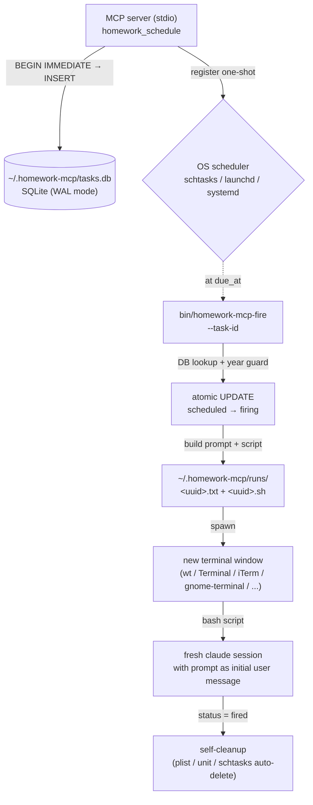

<p align="center">
  
</p>

# homework-mcp

[English](./README.md) ・ **日本語**

> **Claude Code に未来の自分への宿題を仕込む MCP サーバー。** N 日後 / N 週間後 / N ヶ月後の指定時刻に新規ターミナルウィンドウで Claude Code セッションが立ち上がり、仕込んだプロンプトが最初のメッセージとして渡される。

開発中に発生する「あとで判断したい」を OS スケジューラに任せる。自分の記憶ではなく Windows の schtasks / macOS の launchd / Linux の systemd に覚えてもらう。

## なぜ作ったか

Claude Code で開発を高速化するほど、こういう先送りが溜まる:

- 「このコード、1 ヶ月様子を見てから削除するか判断する」
- 「N 日後に対策が要るか再評価する」
- 「依存ライブラリの更新後、2 週間後に挙動を確認する」

人間の記憶では覚えていられない。だが Claude Code セッションは 7 日で expire するし、Cowork のスケジュールタスクはアプリ常駐前提、cloud scheduled タスクは完全バックグラウンドで目に見えない。

`homework-mcp` は OS スケジューラを使って **期日に新規ターミナルウィンドウを開いて、その中で Claude Code を立ち上げ、プロンプトを最初の user message として処理させる**。マシン停止中に期日が過ぎても、起動後に発火する。

## 30 秒で何ができるか

```bash
npm install -g homework-mcp
claude mcp add --scope user homework npx homework-mcp
```

初回起動で `~/.homework-mcp/config.json` 雛形が出力される。OS に応じて埋める:

```jsonc
{
  "os_kind": "wsl2",
  "wsl_distro": "Ubuntu-22.04",
  "macos_terminal": null,
  "linux_terminal": null
}
```

Claude Code から仕込む:

```typescript
homework_schedule({
  due_at: "2026-06-02T09:00:00+09:00",
  prompt: "認証ミドルウェアのリライトが落ち着いたか見る。session token 周りの新しいバグが無いか確認。",
  title: "auth-rewrite-followup"
})
```

期日が来ると新規ターミナルウィンドウが開いて、Claude Code セッションがプロンプト付きで立ち上がる。

## 既存ツールとの違い

| ツール | 不適合理由 |
|---|---|
| Claude Code 純正 `/loop` / 自然言語リマインダ | セッション 7 日 expire |
| Claude Desktop Cowork スケジュールタスク | アプリ常駐前提、新規 CLI セッション起動ではない |
| `claude.ai/code/scheduled` | 完全バックグラウンド、目に見えない |
| `claude_scheduler` (GitHub) | unattended 前提、daemon 方式 |
| `Remind Me` skill / `claude-mcp-reminders` | 通知のみ |

このツールが満たす独自の組み合わせ: **新規セッション + 前面新規ウィンドウ + 1 ヶ月オーダーの期日 + マシン再起動後の自動再開**。

## 状態

**ベータ。** 作者環境（Windows + WSL2）では完全動作確認済み。macOS / Linux の launcher は実装済みだが本番環境での実機検証はコミュニティの PR 待ち。詳細は [Platform support](#platform-support)。

## ツール

### `homework_schedule(due_at, prompt, title?)`

宿題を仕込む。

- `due_at` は ISO 8601 形式でタイムゾーン付き、現在時刻 + 5 分以上先 (制約に違反すると throw)
- `prompt` は自然言語そのままの文字列で SQLite に保存
- `cwd` は呼び出しプロセスから自動取得、発火時にその cwd で claude を起動

発火時、プロンプトに経過時間ヘッダが自動付与される:

```
[homework-mcp からの宿題]

このタスクは {created_at} に仕込まれたものです。
現在は {now} で、{elapsed} 経過しています。
コードベース・状況が変わっている可能性が高いため、
着手前に必ず現状を確認してください。

---
{ユーザーが仕込んだ元プロンプト}
```

仕込み時から状況が変わっている前提で動かせるよう、未来の Claude セッションに「まず現状確認」と促す。

### `homework_list(filter?)`

一覧表示。

```typescript
homework_list()                                   // 既定: scheduled のみ
homework_list({ filter: { status: "fired" } })    // 発火済み
homework_list({ filter: { status: "firing" } })   // クラッシュ候補（下記参照）
homework_list({ filter: { status: "cancelled" } })
```

### `homework_cancel(id)`

予定中の宿題を取り消す。存在しない / 既に firing / fired / cancelled なら throw。

## 動作の仕組み



### 状態遷移

```
発火経路:  scheduled → firing → fired
取消経路:  scheduled → cancelled
```

`firing` は中間チェックポイント。発火スクリプトが `firing` から `fired` の間でクラッシュしたら、その行は `firing` のまま残る（自動再発火しない、人間レビュー対象）。`homework_list({filter:{status:"firing"}})` で取得可能。

### 再入排除

同じ id を 2 回連続で発火させると、片方が atomic な `UPDATE WHERE status='scheduled'` に勝ち、もう片方は `changes()=0` で起動を諦めて exit する。

## Platform support

| OS | 検証状態 |
|---|---|
| Windows + WSL2 | ✅ 作者環境で完全動作確認 |
| Windows native | ⚠️ 実装済み、作者は未検証 |
| macOS | ⚠️ ベータ — コードあり、コミュニティ検証待ち |
| Linux | ⚠️ ベータ — コードあり、コミュニティ検証待ち |

Linux 前提:
- `loginctl enable-linger $USER` を済ませておく（user-systemd がログアウト後も生存するため）
- 登録時に GUI セッションが生きていること（DISPLAY または WAYLAND_DISPLAY が設定されている）

Windows native は `bash` が PATH 必須（Git for Windows または WSL launcher）。

## フォールバック禁止ポリシー

このプロジェクトは **silent fallback 一切禁止** の原則で書かれている:

- 設定欠落 → 起動時 throw、デフォルト埋め込み無し
- スケジューラ登録失敗 → DB 行を ROLLBACK、エラーを上に伝播
- 未対応 OS / WSL1 / Linux ターミナル未指定 → throw、推測しない
- プロンプト本体は `bash $(cat <path>)` の引数渡しで Claude CLI へ（stdin リダイレクトは Claude CLI が non-interactive モードに自動切替する仕様で対話 TUI が起動しないため、実機検証で禁止と確定）

宿題が正しく仕込めない / 正しく発火しないなら、**今**気付ける。期日に到達してから silent に消えてるよりずっと良い。

## 関連プロジェクト

- [Caveat](https://github.com/kitepon-rgb/Caveat) — 罠（負の知識）の長期保存。経過時間ヘッダ前置のアイデア元
- [Relay-MCP](https://github.com/kitepon-rgb/Relay) — SQLite + MCP サーバーのパターン参照元
- [Throughline](https://github.com/kitepon-rgb/Throughline) — context 圧縮、`/clear` 後のセッション間記憶引継ぎ

## License

MIT
