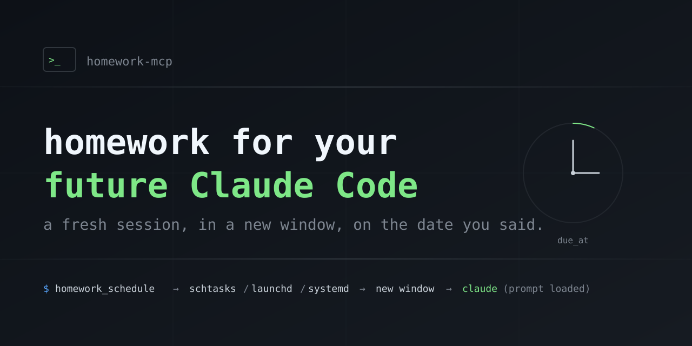
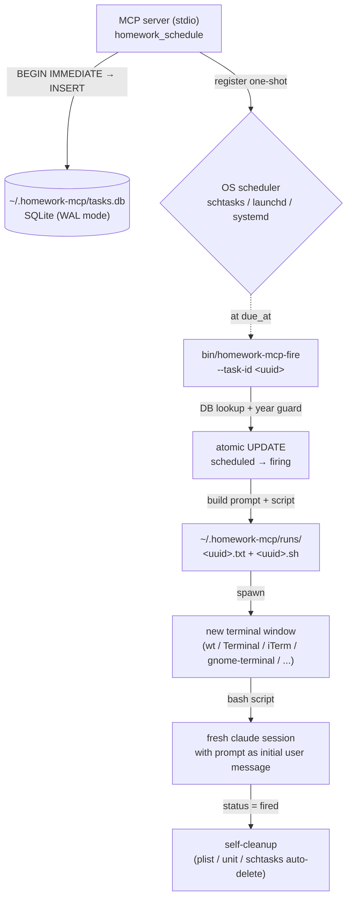

<p align="center">
  
</p>

# homework-mcp

**English** ・ [日本語](./README.ja.md)

[](https://www.npmjs.com/package/homework-mcp)
[](./LICENSE)
[](./package.json)

> **An MCP server that queues homework for your future Claude Code self.** At the due time, a fresh Claude Code session opens in a new terminal window with your prompt pre-loaded as the first user message.

For development decisions you want to revisit in N days / N weeks / N months — when your own memory is no longer reliable.

## 30 seconds to first task

```bash
npm install -g homework-mcp
claude mcp add --scope user homework npx homework-mcp
```

The first run writes a config template to `~/.homework-mcp/config.json` and exits. Fill it in for your OS:

```jsonc
{
  "os_kind": "wsl2",
  "wsl_distro": "Ubuntu-22.04",
  "macos_terminal": null,
  "linux_terminal": null
}
```

Schedule from Claude Code:

```typescript
homework_schedule({
  due_at: "2026-06-02T09:00:00+09:00",
  prompt: "Check whether the auth middleware rewrite landed cleanly. Look for new bugs around session token storage.",
  title: "auth-rewrite-followup"
})
```

When the time comes, a new terminal window opens with a fresh `claude` session, prompt already loaded.

## Why this exists

When you develop fast with Claude Code, you accumulate decisions like:

- *"Watch this code for a month, then decide if it can be deleted."*
- *"Re-evaluate whether we still need a workaround in N days."*
- *"After upgrading this dependency, verify behavior in 2 weeks."*

These pile up. You forget them. They never get processed.

`homework-mcp` solves this by making the OS scheduler open a new Claude Code session at the due time, with the original prompt and an "elapsed time" header automatically prepended. You see a new terminal window appear when the time comes — the homework re-enters your awareness exactly when you said it should.

## How it differs from existing tools

| Tool | Why it doesn't fit |
|---|---|
| Claude Code `/loop` / natural-language reminders | Sessions expire in 7 days |
| Claude Desktop scheduled tasks | Requires the desktop app to be running, doesn't spawn a fresh CLI session |
| `claude.ai/code/scheduled` cloud tasks | Fully background, invisible |
| `claude_scheduler` (GitHub) | Unattended-only, daemon-style |
| `Remind Me` skill / `claude-mcp-reminders` | Notifications only, no fresh session |

The unique combination this tool delivers: **fresh session + foreground new window + multi-month horizon + auto-resume after machine restart**.

## How firing works



### Status state machine

```
fire path:    scheduled → firing → fired
cancel path:  scheduled → cancelled
```

`firing` is an atomic checkpoint. If the fire-script crashes between `firing` and `fired`, the row stays in `firing` for human review (no auto re-fire). `homework_list({filter:{status:"firing"}})` surfaces these.

### Re-entrancy guarantee

Two concurrent fires of the same task: one wins the atomic `UPDATE WHERE status='scheduled'`, the other sees `changes()=0` and exits without launching `claude`. Verified end-to-end in tests.

## Tools

<details><summary><b><code>homework_schedule(due_at, prompt, title?)</code></b></summary>

Schedule a homework task.

- `due_at` must be ISO 8601 **with timezone offset** and **at least 5 minutes in the future**.
- `prompt` is stored verbatim in SQLite. No structure required — write it like a natural-language note.
- The current working directory of the calling process is captured automatically and used when the task fires.

When the task fires, a new terminal window opens in the original `cwd`, and a fresh `claude` session starts with this prompt as the initial user message:

```
[homework-mcp からの宿題]

このタスクは {created_at} に仕込まれたものです。
現在は {now} で、{elapsed} 経過しています。
コードベース・状況が変わっている可能性が高いため、
着手前に必ず現状を確認してください。

---
{your prompt}
```

The "elapsed time" header tells the future Claude session that conditions may have changed and to verify the current state before acting.

</details>

<details><summary><b><code>homework_list(filter?)</code></b></summary>

```typescript
homework_list()                                   // scheduled tasks (default)
homework_list({ filter: { status: "fired" } })    // already fired
homework_list({ filter: { status: "firing" } })   // crash candidates
homework_list({ filter: { status: "cancelled" } })
```

</details>

<details><summary><b><code>homework_cancel(id)</code></b></summary>

Cancel a scheduled task. Throws if the task does not exist or is already in `firing` / `fired` / `cancelled`.

</details>

## Platform support

| Platform | Tested |
|---|---|
| Windows + WSL2 | ✅ End-to-end (the author's environment) |
| Windows native | ⚠️ Implemented, not exercised by author |
| macOS | ⚠️ Beta — code present, awaiting community verification |
| Linux | ⚠️ Beta — code present, awaiting community verification |

<details><summary>Linux / Windows native prerequisites</summary>

Linux requires:
- `loginctl enable-linger $USER` (so user-systemd survives logout)
- A live GUI session at registration time (DISPLAY or WAYLAND_DISPLAY set), so the GUI terminal can be reached when the timer fires

Windows native requires `bash` on PATH (Git for Windows or the WSL launcher).

</details>

## No-fallback policy

This project follows a strict **no-silent-fallback** rule:

- Missing config fields → throw at call time, no defaults.
- Scheduler registration failure → DB row is rolled back, error propagates.
- Unknown OS / WSL1 / unconfigured Linux terminal → throw, never guess.
- Prompt files are passed via `bash $(cat <path>)` argument substitution, not stdin redirection (Claude CLI's TUI is not initialized by stdin pipes, verified empirically).

If a homework task can't be scheduled or fired correctly, you find out **now**, not at the due time when it silently fails to appear.

## Related

- [Caveat](https://github.com/kitepon-rgb/Caveat) — long-term storage of "negative knowledge" (traps), the inspiration for the elapsed-time prompt header.
- [Relay-MCP](https://github.com/kitepon-rgb/Relay) — the SQLite + MCP server pattern this project reuses.
- [Throughline](https://github.com/kitepon-rgb/Throughline) — context compression and cross-session memory carry-over.

## License

MIT — see [LICENSE](./LICENSE).
